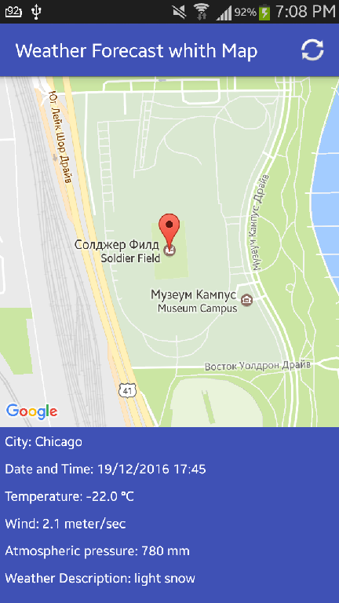
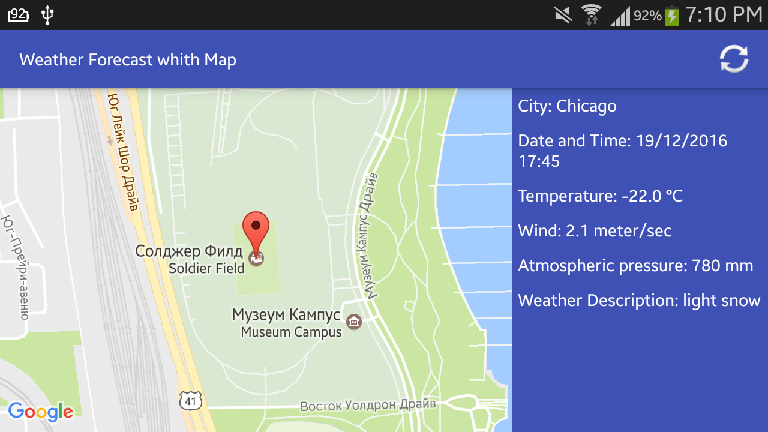

# Weather Forecast whith Map

This is a simple REST client for Android using retrofit2 library.
This application determines the location, receives weather data and displays the current position on the map.

